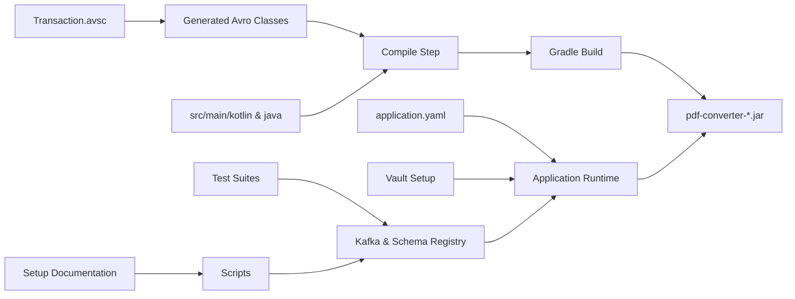

# Project Structure Documentation

## 1. Quick overview
A Kotlin/Java Gradle service that converts PDFs (project root: `pdf-converter`).  
Key responsibilities:
- Application code in `src/`
- Avro schema in `src/main/avro`
- Build outputs in `build/`
- Operational scripts and docs for Kafka, Vault, Docker, and local run

## 2. Top-level files and purpose
1. `build.gradle.kts` — Gradle build file (Kotlin DSL).
2. `settings.gradle.kts` — Gradle settings.
3. `gradlew`, `gradlew.bat`, `gradle/wrapper/*` — Gradle wrapper for reproducible builds.
4. `docker-compose.yml` — Compose setup (likely Kafka, Zookeeper, Schema Registry, Vault, etc.).
5. `README.md`, `QUICKSTART.md`, `HELP.md`, `KAFKA_SETUP.md`, `SCHEMA_REGISTRY.md`, `VAULT_SETUP.md` — project documentation and setup guides.
6. `bin/main/application.yaml` — runtime configuration used in packaging/containers.
7. `scripts/` — operational scripts (Kafka topic creation, produce/consume helpers, permissions, test scripts).

## 3. Major directories and purpose
- `src/`
    - `src/main/kotlin/com/...` — application source code (Kotlin).
    - `src/main/avro/Transaction.avsc` — Avro schema for messages (used for codegen and serialization).
    - `src/main/resources/application.yaml` — runtime configuration (profiles, endpoints, DB config placeholders).
    - `src/test/kotlin/com/...` — unit and integration tests.
    - `src/test/resources/testcontainers.properties` — testcontainers settings used by integration tests.
- `build/` — Gradle output (classes, jars, reports, generated sources and test results). Not committed except some generated artifacts shown in `build/`.
    - `build/libs/pdf-converter-0.0.1-SNAPSHOT.jar` — packaged application jar.
    - `build/generated-main-avro-java/` — Java classes generated from Avro schema.
- `bin/` — packaged runtime files (example `application.yaml` used in executable distribution).
- `generated/` — generated sources (annotation processors, headers, etc.).
- `test/` (top-level test resources used by CI or local runs) — contains `testcontainers.properties`.
- `gradle/` — Gradle wrapper files.
- `scripts/` — helper scripts:
    - `create-topic.sh`, `produce-message.sh`, `consume-messages.sh`, `test-kafka-setup.sh`, `setup-permissions.sh`
- `build/reports/`, `build/test-results/` — test reports and XML results visible in CI.

## 4. Important files referenced in runtime/test flows
- `src/main/avro/Transaction.avsc` → used to generate Java classes in `build/generated-main-avro-java/`.
- `src/main/resources/application.yaml` and `bin/main/application.yaml` → configuration read at runtime.
- `VAULT_SETUP.md` → instructions to store secrets in Vault; application likely reads secrets via environment variables or Vault integration.
- `KAFKA_SETUP.md`, `SCHEMA_REGISTRY.md` → environment setup for Kafka and Schema Registry used by the app.
- `test/resources/testcontainers.properties` → properties controlling Testcontainers (used for integration tests that start Kafka/Postgres locally).

---

## 5. Folder hierarchy (Mermaid)
```mermaid
ggraph TD
  A[pdf-converter/]
  A --> B[build.gradle.kts]
  A --> C[settings.gradle.kts]
  A --> D[gradlew & gradlew.bat]
  A --> E[docker-compose.yml]
  A --> F[Documentation files]
  A --> G[Setup guides]
  A --> H[bin/]
  A --> I[src/]
  A --> J[scripts/]
  A --> K[gradle/]
  A --> L[build/]

  H --> H1[main/application.yaml]
  H --> H2[main/com/...]

  I --> I1[main/]
  I --> I2[test/]

  I1 --> I1a[avro/Transaction.avsc]
  I1 --> I1b[kotlin/com/...]
  I1 --> I1c[resources/application.yaml]

  I2 --> I2a[kotlin/com/... tests]
  I2 --> I2b[resources/testcontainers.properties]

  L --> L1[libs/pdf-converter-*.jar]
  L --> L2[generated-main-avro-java/]
  L --> L3[reports/]
  L --> L4[test-results/]
```

## 6. Component relationships (Mermaid)


## 7. How code and assets work together (brief)
- Avro schema in `src/main/avro` generates classes used by the service for serialization; generated output appears under `build/generated-main-avro-java/`.
- Application code in `src/main/kotlin` uses configuration from `src/main/resources/application.yaml` (and packaged `bin/main/application.yaml`) and runtime secrets possibly from Vault.
- Integration tests use `testcontainers` (properties in test resources) to spin up Kafka/Postgres locally; scripts under `scripts/` help with manual Kafka interaction.
- `docker-compose.yml` can be used to bring up local infrastructure for development (Kafka, Schema Registry, Vault, etc.).

---

## 8. Common developer tasks (commands)
```bash
# Build (Linux)
./gradlew clean build

# Run tests
./gradlew test

# Run locally (jar)
java -jar build/libs/pdf-converter-0.0.1-SNAPSHOT.jar

# Run with Gradle (if Spring Boot or application plugin configured)
./gradlew bootRun

# Start local infra (docker-compose)
docker-compose up -d

# Use Vault instructions (see VAULT_SETUP.md)
# Example from project docs:
# docker exec -it vault-dev sh
# export VAULT_ADDR='http://127.0.0.1:8200'
# export VAULT_TOKEN='dev-root-token'
# vault kv put secret/pdf-converter database.username=dbuser database.password=dbpass123 ...
```

---

# README-ready summary (copy-paste section)

## Project purpose
`pdf-converter` is a Kotlin/Java service that processes PDF inputs and converts/exposes data (uses Avro for message schemas and integrates with Kafka and other services).

## Codebase organization
- `src/main/kotlin/` — application source code.
- `src/main/avro/` — Avro schemas (generates model classes).
- `src/main/resources/` — runtime configuration (`application.yaml`).
- `src/test/` — unit and integration tests (Testcontainers config in resources).
- `scripts/` — helper scripts for Kafka and environment setup.
- `build/` — build outputs (jar, generated sources, test reports).
- `docker-compose.yml` — local infrastructure for Kafka/Schema Registry/Vault.

## Getting started (beginner-friendly)
1. Prerequisites: Java (JDK 17+), Docker & Docker Compose, Git.
2. Clone the repo and enter the folder:
   ```bash
   git clone <repo-url>
   cd pdf-converter
   ```
3. Start local infra (optional, for integration and manual testing):
   ```bash
   docker-compose up -d
   ```
4. Build the project:
   ```bash
   ./gradlew clean build
   ```
5. Run tests:
   ```bash
   ./gradlew test
   ```
6. Run the application:
   ```bash
   java -jar build/libs/pdf-converter-0.0.1-SNAPSHOT.jar
   ```
7. Vault & Kafka setup: follow `VAULT_SETUP.md` and `KAFKA_SETUP.md` for secrets and Kafka topics.

This README snippet is ready to paste into `README.md` for an immediate onboarding summary.