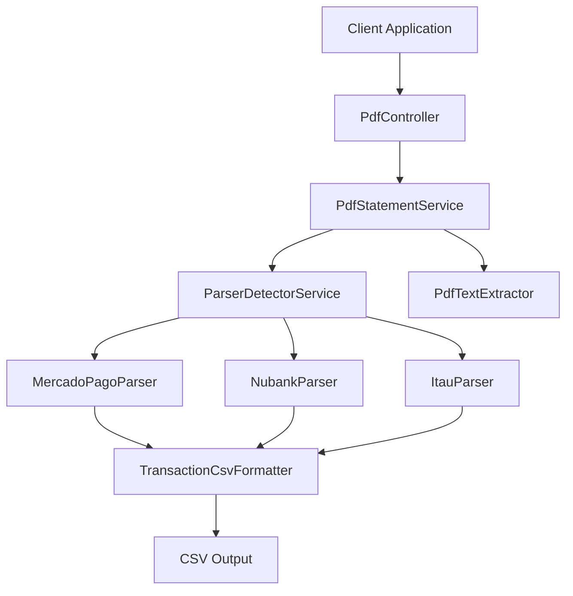
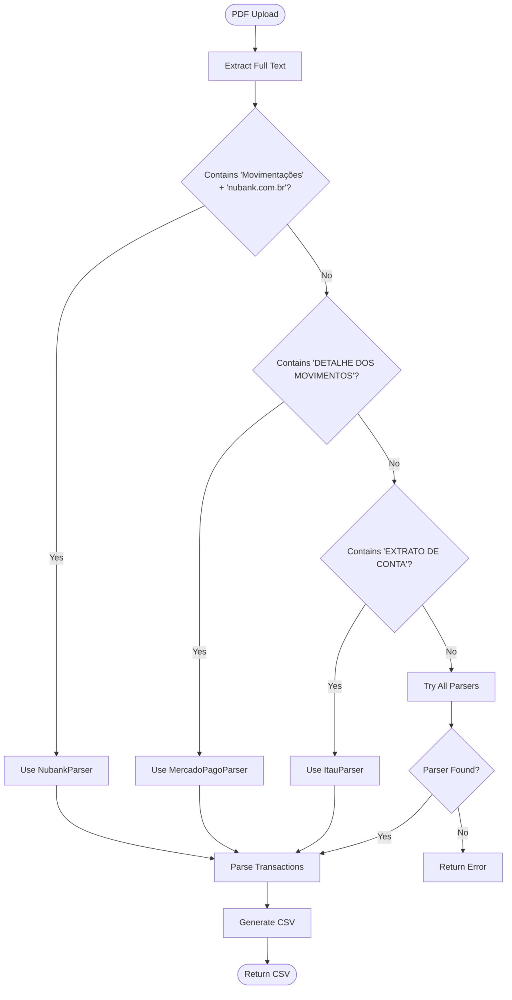
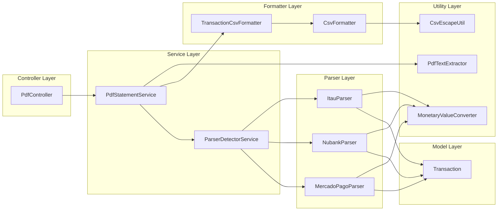
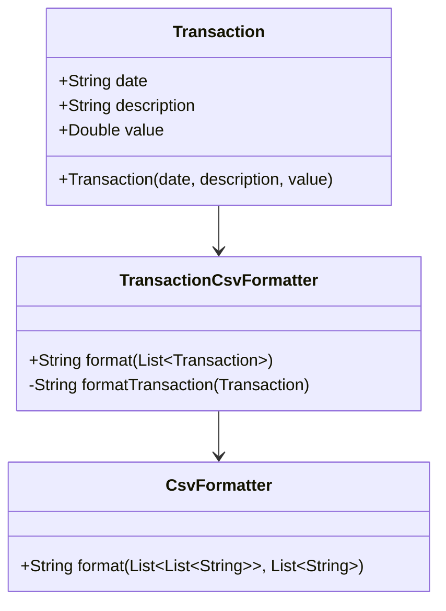
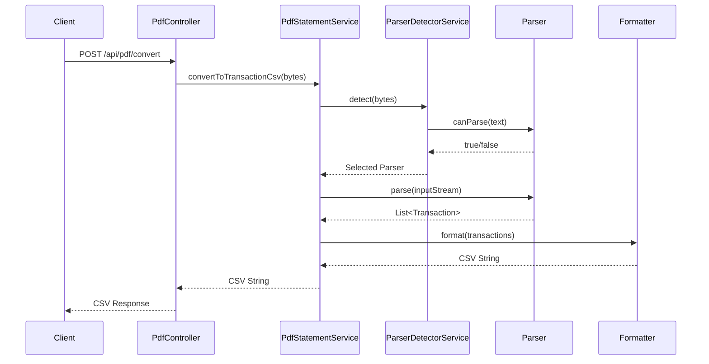

# PDF Converter API

A Spring Boot REST API service that converts PDF financial statements to CSV format with intelligent parser detection for multiple Brazilian banks.

## 🏗️ Architecture Overview



## 🚀 Quick Start

### Prerequisites
- Java 17+
- Gradle 8.14.3+

### Running the Application
```bash
# Clone and navigate to project
cd pdf-converter

# Run the application
./gradlew bootRun

# The API will be available at http://localhost:8080
```

## 📡 API Endpoints

### Convert PDF to CSV
```http
POST /api/pdf/convert
Content-Type: multipart/form-data

file: [PDF file]
```

**Response:**
```http
200 OK
Content-Type: text/plain
Content-Disposition: attachment; filename=extrato.csv

Data,Descrição,Valor (R$)
01/12/2023,PIX RECEBIDO,-150.00
02/12/2023,COMPRA DÉBITO,75.50
```

## 🏦 Supported Banks

| Bank            | Detection Markers                 | Format Support |
|-----------------|-----------------------------------|----------------|
| **MercadoPago** | "DETALHE DOS MOVIMENTOS"          | ✅ Full         |
| **Nubank**      | "Movimentações" + "nubank.com.br" | ✅ Full         |
| **Itaú**        | "EXTRATO DE CONTA"                | ✅ Full         |

## 🔍 Parser Detection Flow



## 🏛️ Project Structure



## 🔧 Technology Stack

- **Framework:** Spring Boot 3.5.7
- **Language:** Kotlin 1.9.25
- **JVM:** Java 17
- **PDF Processing:** Apache PDFBox 2.0.29
- **Messaging:** Apache Kafka (via Spring Kafka)
- **Build Tool:** Gradle 8.14.3
- **Testing:** JUnit 5

## 📨 Kafka Integration

This project includes a local Kafka setup for event-driven capabilities. See [KAFKA_SETUP.md](KAFKA_SETUP.md) for detailed instructions.

### Quick Kafka Setup

```bash
# Start Kafka and Zookeeper
docker-compose up -d

# Create a test topic
./scripts/create-topic.sh test-topic

# Publish a message
./scripts/produce-message.sh test-topic "Hello Kafka!"

# Consume messages
./scripts/consume-messages.sh test-topic
```

### Kafka Consumer in Application

The application includes a `KafkaMessageConsumer` that automatically consumes messages from the `test-topic`:

```kotlin
@Service
class KafkaMessageConsumer {
    @KafkaListener(topics = ["test-topic"], groupId = "pdf-converter-group")
    fun consume(message: String) {
        println("Received message: $message")
    }
}
```

To see it in action:
1. Start Kafka: `docker-compose up -d`
2. Start the application: `./gradlew bootRun`
3. Publish a message: `./scripts/produce-message.sh test-topic "Test message"`
4. Check application logs for the consumed message

## 🧪 Testing

```bash
# Run all tests
./gradlew test

# Run specific test class
./gradlew test --tests "ParserUnitTests"

# Run integration tests
./gradlew test --tests "ControllerIntegrationTests"
```

## 📊 Transaction Model



## 🔄 Processing Pipeline



## 🛠️ Development

### Adding a New Bank Parser

1. **Create Parser Class:**
```kotlin
@Component
class NewBankParser : PdfStatementParser {
    override fun canParse(text: String): Boolean {
        return text.contains("BANK_IDENTIFIER", ignoreCase = true)
    }
    
    override fun parse(inputStream: InputStream): List<Transaction> {
        // Implementation
    }
}
```

1. **Add Detection Logic:**
```kotlin
// In ParserDetectorService.kt
if (fullText.contains("BANK_IDENTIFIER", ignoreCase = true)) {
    // Detection logic
}
```

### Build Commands

```bash
# Clean build
./gradlew clean build

# Generate JAR
./gradlew bootJar

# Check dependencies
./gradlew dependencies
```

## 📝 Example Usage

### cURL Example
```bash
curl -X POST http://localhost:8080/api/pdf/convert \
  -F "file=@extrato.pdf" \
  -H "Content-Type: multipart/form-data" \
  --output extrato.csv
```

### Response Format
```csv
Data,Descrição,Valor (R$)
01/12/2023,PIX RECEBIDO,150.00
02/12/2023,COMPRA DÉBITO,-75.50
03/12/2023,TRANSFERÊNCIA,-200.00
```

## 🚨 Error Handling

The API handles various error scenarios:
- **Unsupported PDF format:** Returns error message
- **Corrupted PDF:** Returns parsing error
- **No parser found:** Returns "unsupported bank" error
- **Empty transactions:** Returns empty CSV with headers

## 📄 License

This project is licensed under the MIT License.