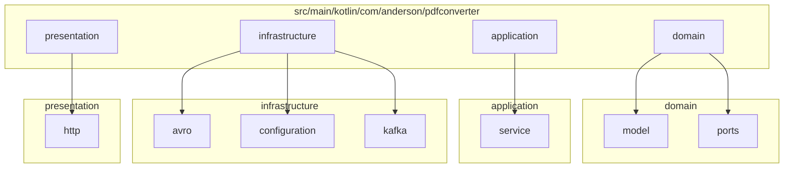
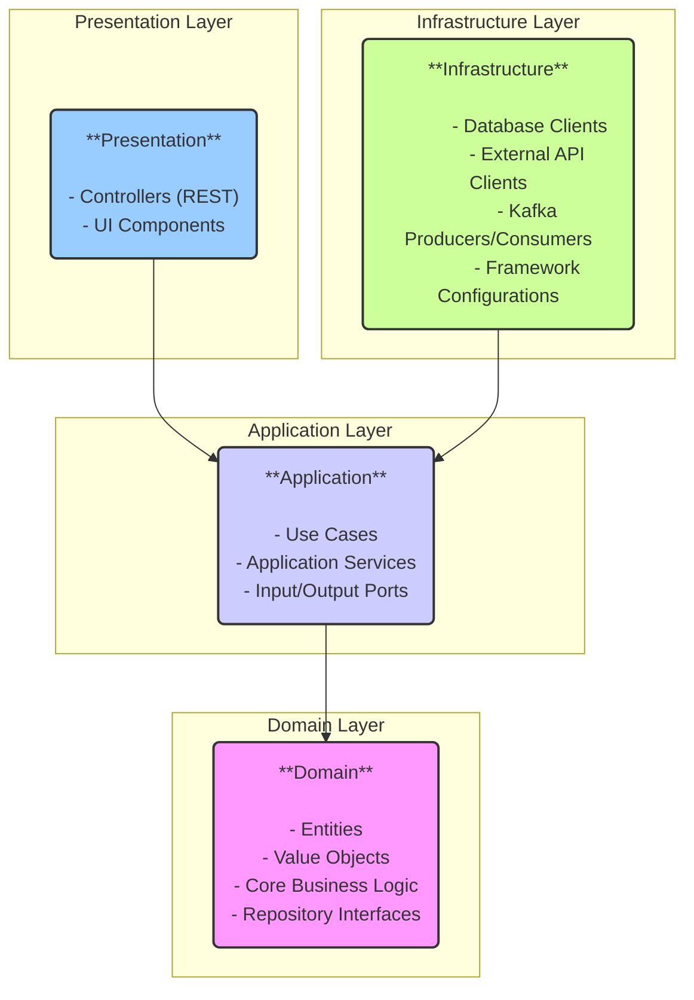

# Clean Architecture Structure

This document outlines the new Clean Architecture structure of the `pdf-converter` project. The goal of this reorganization is to create a more maintainable, scalable, and testable codebase by separating concerns into distinct layers.

## Layers

The project is now divided into the following four layers, with dependencies pointing inward:

-   **Presentation (Interface/Adapters)**: This layer is the entry point to the application. It contains UI components, API controllers, and anything else that interacts with the outside world. It depends only on the Application layer.
-   **Infrastructure**: This layer contains the implementations of interfaces defined in the Application and Domain layers. It includes database access, external API clients, messaging systems (like Kafka), and other external dependencies.
-   **Application (Use Cases)**: This layer contains the application-specific business logic. It orchestrates the flow of data between the Domain and Infrastructure layers and implements the use cases of the application.
-   **Domain**: This is the core of the application. It contains the business entities, value objects, and core business rules. It has no dependencies on any other layer.

## Folder Hierarchy

The new folder structure is as follows:

## Dependency Flow

The dependencies between the layers flow inward, with the Domain layer at the center. This ensures that the core business logic is independent of the application's infrastructure and presentation details.

